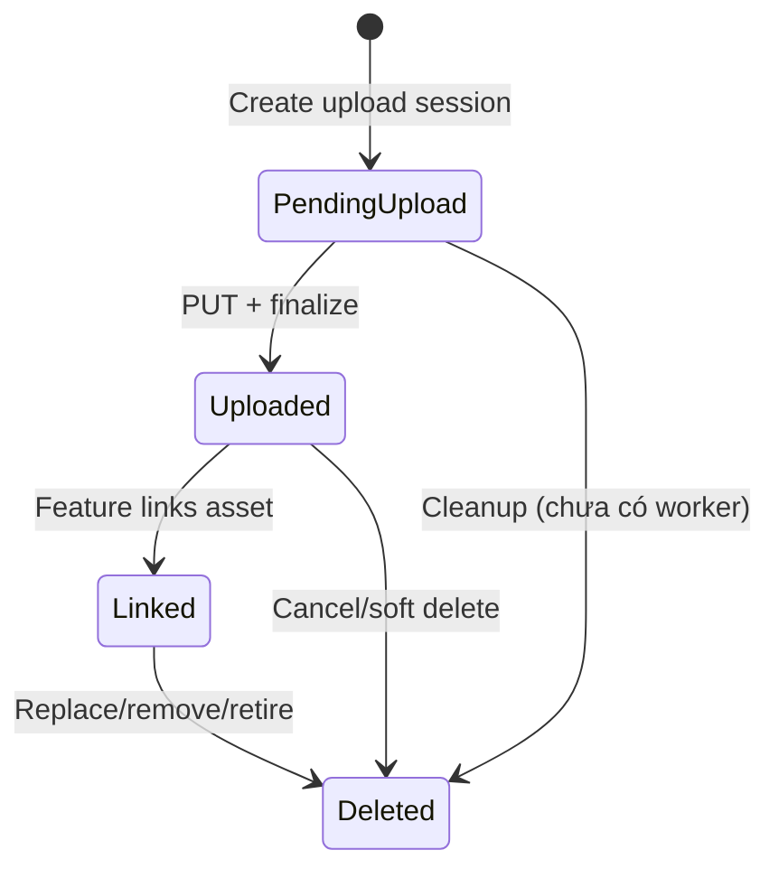

# AWS S3 Media Implementation Guide

## 1. Mục đích

Tài liệu này mô tả cách Smart Rental Platform lưu trữ và phân phối file bằng AWS S3 thông qua media schema mới. Nội dung tập trung vào:

- Kiến trúc media và vai trò của AWS S3.
- Vòng đời upload, finalize, link, đọc, download và retire media.
- Public/private permission model.
- Các tính năng đã chuyển sang media schema.
- Cách triển khai một tính năng mới có upload file.
- Cấu hình AWS, CORS, IAM và cách vận hành an toàn.
- Test, troubleshooting và các giới hạn hiện tại.

Tài liệu phản ánh code trên nhánh `feat/local-to-cloud-storage` tại thời điểm viết. Không đưa access key, secret key hoặc URL có chữ ký thật vào source control, log, issue hoặc tài liệu.

Hướng dẫn dạng checklist dành riêng cho việc phát triển tính năng sau này nằm tại [AWS S3 New Feature Playbook](./AWS_S3_New_Feature_Playbook.md).

## 2. Kết quả của đợt migration

Hệ thống không còn coi URL file là dữ liệu gốc. Dữ liệu gốc là `MediaAsset.Id`, còn URL được tạo tại read path dựa trên ID và quyền truy cập.

Các thay đổi chính:

- Thêm `MediaAsset` và `MediaAuditLog`.
- Thêm abstraction `IMediaStorageService` để tách business logic khỏi S3 SDK.
- Thêm upload session, presigned S3 `PUT`, backend proxy fallback và finalize.
- Thêm public/private/admin media endpoints.
- Thêm permission service theo owner, admin và linked business entity.
- Thêm scope-specific validation cho extension, MIME type và dung lượng.
- Chuyển các feature từ legacy URL sang `media_asset_id`.
- Xóa `IPrivateStorageService` và các private/local file service cũ khỏi runtime path.
- Client đọc private image bằng authenticated blob thay vì đặt private URL trực tiếp vào ``.

Nguyên tắc quan trọng:

1. Database lưu metadata và relationship; S3 lưu binary object.
2. Business entity tham chiếu `MediaAsset.Id`, không tham chiếu presigned URL.
3. Presigned URL là dữ liệu tạm thời, không được persist.
4. Feature service chịu trách nhiệm validate và link asset vào entity.
5. Public/private là quyết định nghiệp vụ, không chỉ là tên folder S3.

## 3. Kiến trúc tổng thể

```mermaid
flowchart LR
    UI["React feature"] --> MC["Client media API"]
    MC -->|"1. Create session"| API["MediaController"]
    API --> WF["MediaWorkflowService"]
    WF --> DB[("PostgreSQL media_assets")]
    WF --> KEY["MediaObjectKeyFactory"]
    WF --> S3A["S3StorageService"]
    MC -->|"2. PUT binary"| S3[("AWS S3")]
    MC -. "CORS/network fallback" .->|"PUT backend proxy"| API
    API --> S3A
    S3A --> S3
    MC -->|"3. Finalize"| API
    WF -->|"HEAD metadata"| S3A
    UI -->|"4. Submit mediaAssetId"| FEATURE["Feature service"]
    FEATURE -->|"Validate and link"| DB
    UI -->|"5. View/download"| API
    API --> ACCESS["MediaAccessService"]
    ACCESS --> PERM["DefaultMediaPermissionService"]
    ACCESS --> S3A
```

### 3.1 Các thành phần chính

| Thành phần | Trách nhiệm |
|---|---|
| `MediaAsset` | Lưu owner, bucket, object key, metadata, scope, visibility, status và linked entity. |
| `MediaAuditLog` | Ghi create session, upload, finalize, view, download, denied access và delete. |
| `IMediaStorageService` | Contract storage độc lập với AWS SDK. |
| `S3StorageService` | Upload/read/head/delete object và tạo presigned URL. |
| `MediaObjectKeyFactory` | Sinh object key không trùng, có visibility/scope/date prefix. |
| `MediaWorkflowService` | Quản lý upload session, finalize và soft delete. |
| `MediaAccessService` | Kiểm tra status/permission trước khi đọc hoặc tạo download URL. |
| `DefaultMediaPermissionService` | Quyết định ai được xem/download/delete private asset. |
| `MediaFileValidationPolicy` | Validate file khai báo, proxy upload và metadata thực tế trên S3. |
| `MediaController` | Public/private delivery và upload workflow endpoints. |
| `AdminMediaController` | Admin view/download private media với audit. |
| `MediaBackedFileStorageService` | Adapter cho server-side generated/uploaded files vẫn dùng `IFileStorageService`. |

### 3.2 Storage registration hiện tại

`DependencyInjection.AddInfrastructure` đăng ký:

```csharp
services.Configure<S3StorageOptions>(configuration.GetSection("Aws:S3"));
services.AddSingleton<IAmazonS3>(provider =>
{
    var options = provider.GetRequiredService<IOptions<S3StorageOptions>>().Value;
    return S3StorageService.CreateClient(options);
});
services.AddScoped<S3StorageService>();
services.AddScoped<IMediaStorageService>(provider =>
    provider.GetRequiredService<S3StorageService>());
```

Do đó runtime hiện tại luôn dùng S3. `LocalMediaStorageService` vẫn tồn tại và hỗ trợ backend proxy, nhưng chưa có configuration switch để thay `IMediaStorageService` tại runtime. Muốn chạy hoàn toàn local cần bổ sung strategy trong DI; chỉ để trống AWS config sẽ làm khởi tạo S3 client thất bại.

## 4. Media data model

### 4.1 `MediaAsset`

Các trường quan trọng:

| Field | Ý nghĩa |
|---|---|
| `Id` | Stable ID được business entity và API sử dụng. |
| `OwnerUserId` | User tạo/sở hữu asset; dùng cho manage/delete và fallback permission. |
| `BucketName` | Bucket đã lưu object. |
| `ObjectKey` | Key nội bộ trên S3; không trả trực tiếp cho client. |
| `OriginalFileName` | Tên để hiển thị/download. |
| `StoredFileName` | Tên random trong object key. |
| `ContentType` | MIME type đã khai báo và được đối chiếu lúc finalize. |
| `FileSize` | Kích thước đã khai báo và được đối chiếu với S3 metadata. |
| `FileHash` | Optional hash của binary. |
| `Scope` | Mục đích nghiệp vụ của file. |
| `Visibility` | `Public` hoặc `Private`. |
| `Status` | Trạng thái vòng đời. |
| `LinkedEntityType/Id` | Entity đang sử dụng asset. |
| `DeletedAt` | Thời điểm soft delete/retire. |

### 4.2 Trạng thái



Các trạng thái enum đầy đủ là `PendingUpload`, `Uploaded`, `Linked`, `Approved`, `Rejected`, `Deleted`. Upload workflow chính hiện dùng ba trạng thái đầu và `Deleted`; `Approved/Rejected` dành cho workflow cần moderation/approval.

### 4.3 Object key convention

Format:

```text
{public|private}/{scope-folder}/{yyyy}/{MM}/{dd}/{random-guid}{extension}
```

Ví dụ:

```text
public/rooming-house-images/2026/07/16/8f3...a1.webp
private/kyc-documents/2026/07/16/5b2...9c.jpg
private/contract-pdfs/2026/07/16/74e...02.pdf
```

Không dùng original file name làm object key để tránh collision, path traversal và lộ thông tin cá nhân.

## 5. Scope, visibility và validation

| Scope | Giá trị | Visibility chuẩn | File cho phép | Max |
|---|---:|---|---|---:|
| `RoomingHouseImage` | 1 | Public | JPG, JPEG, PNG, WebP | 10 MB |
| `RoomImage` | 2 | Public | JPG, JPEG, PNG, WebP | 10 MB |
| `RoomingHouseLegalDocument` | 3 | Private | JPG, JPEG, PNG, WebP | 10 MB |
| `KycDocument` | 4 | Private | JPG, JPEG, PNG, WebP | 10 MB |
| `ContractPdf` | 5 | Private | PDF | 20 MB |
| `ContractAppendixPdf` | 6 | Private | PDF | 20 MB |
| `MeterReadingImage` | 7 | Private | JPG, JPEG, PNG, WebP | 10 MB |
| `ChatAttachment` | 8 | Private | JPG, JPEG, PNG, WebP, PDF | 20 MB |
| `RoomingHouseRulePdf` | 9 | Public | PDF | 20 MB |
| `Avatar` | 10 | Public | JPG, JPEG, PNG, WebP | 5 MB |

Visibility enum gửi từ client:

- `Public = 1`
- `Private = 2`

Validation diễn ra ba lần:

1. Khi tạo upload session: extension, declared MIME và declared size.
2. Khi upload qua backend proxy: request MIME/size phải khớp session.
3. Khi finalize: S3 object phải tồn tại; actual MIME/size phải khớp metadata session.

Lưu ý: validation hiện dựa trên extension, MIME và object metadata; chưa sniff magic bytes. Feature có yêu cầu bảo mật cao có thể bổ sung content inspection/virus scan trước khi chuyển sang `Linked`.

## 6. Upload workflow

### 6.1 Bước 1 - Tạo upload session

```http
POST /api/media/upload-url
Authorization: Bearer <token>
Content-Type: application/json

{
  "originalFileName": "front.jpg",
  "contentType": "image/jpeg",
  "fileSize": 245760,
  "scope": 4,
  "visibility": 2
}
```

Server thực hiện:

1. Validate request theo scope.
2. Sinh object key.
3. Tạo `MediaAsset` trạng thái `PendingUpload`.
4. Tạo presigned S3 `PUT` có TTL 15 phút.
5. Ghi `CreateUploadSession` audit log.

Response chính:

```json
{
  "mediaAssetId": "...",
  "uploadUrl": "https://...s3...",
  "httpMethod": "PUT",
  "deliveryMode": "signed-upload-url",
  "expiresAtUtc": "..."
}
```

Nếu storage không hỗ trợ signed upload, response dùng `deliveryMode = backend-proxy` và URL `/api/media/upload/{mediaAssetId}`.

### 6.2 Bước 2 - Upload binary

Luồng ưu tiên:

```http
PUT <presigned-s3-url>
Content-Type: image/jpeg

<binary>
```

Presigned URL được tạo kèm `Content-Type`, vì vậy header lúc `PUT` phải giống content type đã dùng để tạo session.

Nếu browser bị S3 CORS/network error, client tự retry:

```http
PUT /api/media/upload/{mediaAssetId}
Authorization: Bearer <token>
Content-Type: image/jpeg

<binary>
```

Backend proxy vẫn validate owner, status, MIME và size trước khi gọi `S3StorageService.UploadAsync`.

Object do backend upload được đặt server-side encryption `AES256` (SSE-S3).

### 6.3 Bước 3 - Finalize

```http
POST /api/media/finalize
Authorization: Bearer <token>
Content-Type: application/json

{
  "mediaAssetId": "...",
  "fileHash": null
}
```

Finalize không tin rằng `PUT` đã thành công. Server gọi S3 `HEAD`, kiểm tra object tồn tại, content type và content length, sau đó chuyển `PendingUpload -> Uploaded` và ghi audit log.

### 6.4 Bước 4 - Link vào feature

Finalize chỉ cho biết binary hợp lệ trong storage. Asset chưa thuộc business entity cho đến khi feature service xử lý ID.

Feature request phải gửi `mediaAssetId`, ví dụ:

```json
{
  "frontMediaAssetId": "...",
  "backMediaAssetId": "...",
  "selfieMediaAssetId": "..."
}
```

Feature service phải validate:

- Asset tồn tại.
- `OwnerUserId` đúng actor.
- `Scope` đúng feature.
- `Visibility` đúng policy.
- `Status == Uploaded`, hoặc asset đang `Linked` đúng entity hiện tại nếu update idempotent.
- Asset chưa link sang entity khác.
- Content type phù hợp khi feature cần rule chặt hơn.

Sau đó set:

```csharp
asset.Status = MediaStatus.Linked;
asset.LinkedEntityType = nameof(TargetEntity);
asset.LinkedEntityId = targetEntity.Id;
asset.DeletedAt = null;
```

Reference của entity và thay đổi trên `MediaAsset` phải được save trong cùng transaction/`SaveChanges`.

## 7. Read và download workflow

### 7.1 Public media

Route:

```text
GET /api/media/public/{mediaAssetId}
```

Không yêu cầu authentication. Controller chỉ phục vụ asset:

- `Visibility == Public`.
- Không ở `PendingUpload` hoặc `Deleted`.

Binary được stream từ S3 qua API với range processing. DTO/public UI nên dùng URL này, không dùng S3 object key hoặc bucket URL.

Client:

```tsx

```

### 7.2 Private inline view

Route:

```text
GET /api/media/private/{mediaAssetId}
Authorization: Bearer <token>
```

Không đặt route này trực tiếp vào `` nếu authentication dùng bearer header. Dùng `PrivateMediaImage`, component sẽ:

1. Fetch blob qua `apiClient` có token.
2. Tạo `blob:` object URL.
3. Render ``.
4. `URL.revokeObjectURL` khi source thay đổi hoặc unmount.

```tsx
<PrivateMediaImage
  mediaAssetId={document.frontMediaAssetId}
  alt="Mặt trước giấy tờ"
/>
```

### 7.3 Private download

Các lựa chọn:

```text
GET /api/media/private/{id}/download
GET /api/media/private/{id}/download-url
GET /api/media/{id}/download-url
```

`download-url` trả:

- S3 presigned GET, TTL 5 phút, `deliveryMode = signed-url`; hoặc
- Authenticated backend route, `deliveryMode = backend-route`, nếu storage không hỗ trợ signed download.

Admin dùng namespace riêng:

```text
GET /api/admin/media/private/{id}
GET /api/admin/media/private/{id}/download
GET /api/admin/media/private/{id}/download-url
```

## 8. Permission model

### 8.1 Rule tổng quát

- Public asset: ai cũng được view/download nếu status hợp lệ.
- Private owner: `OwnerUserId` được truy cập.
- Admin: được truy cập private media qua permission service/admin endpoints.
- Linked private asset: actor có thể được cấp quyền theo business relationship.
- Delete: mặc định chỉ owner hoặc admin ở controller workflow.
- `PendingUpload` và `Deleted`: không được view/download.

### 8.2 Permission theo linked entity

| Linked entity | Người được truy cập private media |
|---|---|
| `KycVerification` | Chủ hồ sơ KYC và admin. |
| `RoomingHouseLegalDocument` | Landlord sở hữu khu trọ và admin. |
| `MeterReading` | Landlord; tenant/occupant có invoice không phải Draft trong kỳ phù hợp; admin. |
| `ChatMessage` | Participant chưa rời và đã join trước thời điểm message; admin. |
| `ContractFile` | Theo contract purpose, landlord, current/former main tenant và appendix policy. |
| `ContractOccupantDocument` | Landlord hoặc main tenant có quyền theo contract; admin. |
| `RoomingHouseRule` | Permission service có owner rule, nhưng production rule hiện được lưu Public nên mọi người đọc qua public route. |

Mỗi view/download/denied access được ghi vào `media_audit_logs` cùng actor, IP, user agent và metadata route.

## 9. Các feature đã triển khai

### 9.1 Ảnh khu trọ và phòng

- Scope: `RoomingHouseImage` hoặc `RoomImage`.
- Visibility: Public.
- Entity link: `PropertyImage.MediaAssetId`.
- Tối đa 10 ảnh ở server, không chỉ client.
- Cover được chọn từ media-backed `PropertyImage`; read model build `/api/media/public/{id}`.
- Khi replace/remove, asset cũ được retire và reference cũ bị loại.
- Listing/search chính build cover từ media asset ID, không nên đọc legacy URL làm source of truth.

### 9.2 Giấy tờ pháp lý khu trọ

- Scope: `RoomingHouseLegalDocument`.
- Visibility: Private.
- Ba reference: `FrontMediaAssetId`, `BackMediaAssetId`, `ExtraMediaAssetId`.
- Owner landlord và admin được xem.
- Client render bằng `PrivateMediaImage`.

### 9.3 Luật khu trọ

- Scope: `RoomingHouseRulePdf`.
- Visibility: Public.
- Entity link: `RoomingHouseRule.MediaAssetId`.
- Đây là tài liệu công khai: anonymous/tenant/landlord đều đọc qua public route.
- Không đổi rule sang private chỉ vì file nằm trong quy trình quản lý của landlord.

### 9.4 KYC

- Scope: `KycDocument`.
- Visibility: Private.
- References: front, back, selfie trên `KycVerification`.
- Submit chỉ nhận asset đã upload của đúng user.
- Status response trả lại đủ ba media ID để owner xem sau reload.
- Owner và admin được xem; user khác/anonymous bị chặn.

### 9.5 User và conversation avatar

- Scope: `Avatar`.
- Visibility: Public.
- References: `User.AvatarMediaAssetId`, `Conversation.AvatarMediaAssetId`.
- Thay avatar retire asset cũ.
- Xóa group avatar dùng presence semantics rõ ràng: `clearAvatar: true`.
- Không dùng `avatarMediaAssetId: null` để biểu diễn clear vì contract nullable thông thường không phân biệt omitted và explicit null.

### 9.6 Chat attachment

- Scope: `ChatAttachment`.
- Visibility: Private.
- Entity link: `ChatMessage.MediaAssetId`.
- Hỗ trợ image và PDF.
- Chỉ participant hợp lệ của conversation được xem/download.
- Delete message retire linked media asset.

### 9.7 Meter reading proof

- Scope: `MeterReadingImage`.
- Visibility: Private.
- Entity link: `MeterReading.ProofMediaAssetId`.
- Landlord xem; tenant/occupant chỉ xem khi invoice visibility rule cho phép.
- Tenant và landlord UI dùng authenticated private blob/lightbox.

### 9.8 Contract, appendix, signing và occupant documents

- Contract PDF: `ContractPdf`, Private.
- Appendix PDF: `ContractAppendixPdf`, Private.
- Contract files link qua `ContractFile.MediaAssetId`.
- Signing envelope giữ media ID cho unsigned, signed và evidence files.
- Occupant identity documents giữ front/back/extra media IDs và dùng private KYC-compatible validation.
- Server-generated PDF đi qua `MediaBackedFileStorageService`, upload thẳng backend -> S3 -> tạo `MediaAsset`.
- Download permission phụ thuộc contract purpose và participant policy, không chỉ owner ID.

### 9.9 Review image

- Review image tái sử dụng `RoomingHouseImage` + Public.
- Reference nằm trên `PropertyImage.MediaAssetId` liên kết với review.
- Service validate owner, scope, visibility và reuse trước khi link.

## 10. Cách thêm media cho feature mới

### 10.1 Checklist thiết kế

Trước khi code, trả lời các câu hỏi:

- File public hay private?
- Ai upload, ai sở hữu, ai được xem/download/delete?
- Feature cần image, PDF hay loại file mới?
- Max size và max file count?
- Một asset có được reuse không?
- Khi replace/remove thì asset cũ chuyển trạng thái nào?
- Binary do browser upload hay server sinh?
- Linked entity nào là nguồn để permission service kiểm tra?

### 10.2 Bước server

1. Thêm `MediaScope` mới nếu không thể tái sử dụng scope hiện tại.
2. Thêm folder mapping trong `MediaObjectKeyFactory`.
3. Thêm validation rule trong `MediaFileValidationPolicy`.
4. Thêm `MediaAssetId` nullable FK/reference vào entity và EF configuration/migration.
5. Request contract nhận media ID, không nhận S3 URL.
6. Feature service resolve asset và validate owner/scope/visibility/status.
7. Link asset và entity trong cùng transaction.
8. Retire asset cũ khi replace/remove.
9. Thêm linked-entity permission rule nếu private asset cần chia sẻ ngoài owner/admin.
10. Read DTO trả `MediaAssetId` và app media route.
11. Thêm unit/regression tests cho happy path, wrong owner, wrong scope, reuse và retire.

Ví dụ helper link:

```csharp
private async Task<MediaAsset> ResolveFeatureAssetAsync(
    Guid mediaAssetId,
    Guid actorUserId,
    Guid entityId,
    CancellationToken cancellationToken)
{
    var asset = await context.MediaAssets
        .FirstOrDefaultAsync(x => x.Id == mediaAssetId, cancellationToken)
        ?? throw new BadRequestException("FEATURE_MEDIA_NOT_FOUND", "Media asset không tồn tại.");

    if (asset.OwnerUserId != actorUserId)
        throw new ForbiddenException("FEATURE_MEDIA_FORBIDDEN", "Không có quyền dùng media asset.");

    if (asset.Scope != MediaScope.YourScope ||
        asset.Visibility != MediaVisibility.Private ||
        asset.Status != MediaStatus.Uploaded ||
        asset.LinkedEntityId.HasValue)
    {
        throw new BadRequestException("FEATURE_MEDIA_INVALID", "Media asset không hợp lệ.");
    }

    asset.Status = MediaStatus.Linked;
    asset.LinkedEntityType = nameof(YourEntity);
    asset.LinkedEntityId = entityId;
    asset.DeletedAt = null;
    asset.UpdatedAt = DateTimeOffset.UtcNow;
    return asset;
}
```

Không copy helper mẫu mà bỏ qua idempotent update. Nếu feature cho phép gửi lại cùng asset đang link đúng entity, cần xử lý trường hợp đó riêng.

### 10.3 Bước client

1. Thêm scope vào `MediaWorkflowScope` và numeric maps trong `shared/api/media.ts` nếu scope mới.
2. Upload bằng `uploadFileViaMediaWorkflow` hoặc wrapper `uploadImage/uploadPdf`.
3. Giữ `mediaAssetId` trong form state.
4. Submit business request bằng ID.
5. Public image dùng public route.
6. Private image dùng `PrivateMediaImage`.
7. Private download gọi `getPrivateMediaDownloadUrl` hoặc authenticated download route.
8. Hiển thị loading/error và cleanup object URL.

Ví dụ:

```tsx
const uploaded = await uploadImage(file, 'KycDocument');

await featureApi.save({
  documentMediaAssetId: uploaded.mediaAssetId
});
```

Không lưu `uploaded.url` làm source of truth; URL chỉ dùng preview/read compatibility.

## 11. Cấu hình AWS S3

### 11.1 Application configuration

Section được bind là `Aws:S3`:

```json
{
  "Aws": {
    "S3": {
      "AccessKeyId": "<do-not-commit>",
      "SecretAccessKey": "<do-not-commit>",
      "Region": "ap-southeast-1",
      "BucketName": "<media-bucket>"
    }
  }
}
```

Ưu tiên environment variables hoặc secret manager:

```powershell
$env:Aws__S3__AccessKeyId = "..."
$env:Aws__S3__SecretAccessKey = "..."
$env:Aws__S3__Region = "ap-southeast-1"
$env:Aws__S3__BucketName = "..."
dotnet run --project server/src/SmartRentalPlatform.Api
```

`Program.cs` load optional `appsettings.Local.json`; file này chỉ phù hợp cho local secret và phải nằm trong `.gitignore`. Không đưa credential thật vào `appsettings.json` đã track.

Code hiện tạo `AmazonS3Client` bằng static access key/secret. Với production trên ECS/EC2/Lambda, nên chuyển sang AWS default credential provider chain và IAM role thay vì long-lived key.

### 11.2 IAM tối thiểu

Policy cần giới hạn vào đúng bucket/prefix. Ví dụ tham khảo:

```json
{
  "Version": "2012-10-17",
  "Statement": [
    {
      "Effect": "Allow",
      "Action": [
        "s3:GetObject",
        "s3:PutObject",
        "s3:DeleteObject"
      ],
      "Resource": "arn:aws:s3:::YOUR_BUCKET/*"
    },
    {
      "Effect": "Allow",
      "Action": ["s3:ListBucket"],
      "Resource": "arn:aws:s3:::YOUR_BUCKET"
    }
  ]
}
```

Không cấp `s3:*` trên mọi bucket. Nếu production không gọi bucket connectivity check thì có thể rà lại nhu cầu `ListBucket`.

### 11.3 Bucket settings

Khuyến nghị:

- Bật Block Public Access.
- Không tạo public-read ACL; public media vẫn đi qua API route.
- Bật default encryption; code backend upload cũng yêu cầu SSE-S3 AES256.
- Bật versioning nếu cần khả năng điều tra/khôi phục.
- Thêm lifecycle cho orphan/pending objects sau khi có tag hoặc cleanup strategy phù hợp.
- Bật access logging/CloudTrail data events nếu yêu cầu audit cao.

### 11.4 CORS cho direct browser upload

Presigned `PUT` từ browser cần bucket CORS. Ví dụ:

```json
[
  {
    "AllowedHeaders": ["Content-Type"],
    "AllowedMethods": ["PUT"],
    "AllowedOrigins": [
      "http://localhost:5173",
      "https://YOUR_CLIENT_DOMAIN"
    ],
    "ExposeHeaders": ["ETag"],
    "MaxAgeSeconds": 3000
  }
]
```

Không dùng `AllowedOrigins: ["*"]` cho production nếu có thể liệt kê domain. Nếu CORS sai, client hiện fallback qua backend proxy nên upload vẫn có thể thành công, nhưng sẽ tăng bandwidth và tải cho API server.

## 12. Security rules

- Không log presigned URL đầy đủ vì URL chứa temporary signature.
- Không persist presigned URL trong DB.
- Không trả `ObjectKey`, bucket name hoặc AWS credential cho client.
- Không dựa vào folder `private/` làm authorization; luôn gọi permission service.
- Không cho feature link asset chỉ bằng ID mà bỏ qua owner/scope/status/reuse checks.
- Không cho private `` gọi thẳng route nếu bearer token không được gửi.
- Không tin MIME/size từ browser; finalize phải kiểm tra metadata storage.
- Không reuse một `Uploaded` asset cho nhiều entity nếu feature không thiết kế rõ relationship.
- Khi replace/remove, update reference và retire asset trong cùng transaction.
- Admin access vẫn phải audit.
- Với KYC/identity documents, cân nhắc malware scanning, retention policy và KMS key riêng trước production.

## 13. Delete và retention

Hiện có hai khái niệm:

- Soft delete/retire: DB chuyển `MediaStatus.Deleted`, set `DeletedAt`, bỏ linked entity.
- Physical delete: gọi `IMediaStorageService.DeleteAsync` để xóa object S3.

**Giới hạn hiện tại (MT-008):** `MediaWorkflowService.SoftDeleteAsync` và các feature retire path chỉ soft delete DB, chưa gọi S3 delete. Vì vậy:

- API media chặn truy cập mới sau delete.
- Object vẫn tồn tại trong bucket.
- Presigned URL đã cấp có thể tiếp tục dùng đến khi hết hạn.

Không mô tả `Deleted` là physical deletion trong UI/audit/compliance. Cần một worker/outbox an toàn để xóa object sau khi transaction DB commit và retry khi S3 lỗi.

**Giới hạn hiện tại (MT-009):** chưa có worker cleanup `PendingUpload` hết hạn. Upload session TTL là 15 phút nhưng row/object orphan không tự chuyển `Deleted`.

Đề xuất worker:

1. Query `PendingUpload` cũ hơn TTL + grace period.
2. Lock/claim batch để tránh chạy trùng.
3. Xóa object nếu tồn tại.
4. Chuyển asset sang `Deleted`, ghi audit reason `ExpiredUploadSession`.
5. Retry có backoff và metric/alert.

## 14. Testing

### 14.1 Automated tests quan trọng

- `MediaWorkflowServiceTests`: create session, finalize, validation và delete state.
- `MediaAccessServiceTests`: public/private/status/permission/audit.
- `DefaultMediaPermissionServiceTests`: business relationship matrix.
- `S3StorageServiceTests`: key normalization, signed URL và storage behavior.
- `MediaObjectKeyFactoryTests`: folder/prefix/date/random file name.
- `MediaMigrationRegressionTests`: KYC/property/avatar legacy cutover.
- Feature tests: KYC, rooming house, room, chat, billing, contracts và user avatar.
- Client Vitest: media API, KYC submit, chat upload/clear avatar.

Lệnh tham khảo:

```powershell
dotnet test server/tests/SmartRentalPlatform.UnitTests/SmartRentalPlatform.UnitTests.csproj --no-restore

Set-Location client
npm run test:run
npm run build
```

### 14.2 Manual smoke test cho feature mới

- Upload đúng type/size -> finalize `Uploaded`.
- Upload sai extension/MIME/size -> `400 VALIDATION_ERROR`.
- Submit feature -> asset `Linked`, entity giữ đúng media ID.
- Reload -> public/private media render lại.
- Anonymous/user khác -> đúng `401/403/404` theo visibility.
- Owner/admin/related participant -> đúng `200`.
- Replace -> reference mới, asset cũ `Deleted`.
- Remove -> reference null, reload không xuất hiện lại.
- Direct S3 upload lỗi CORS -> backend fallback thành công.
- Signed download URL hết hạn đúng TTL.
- Audit log có create/finalize/view/download/denied/delete phù hợp.

Checklist media đầy đủ nằm tại `docs/Media_Manual_Test_Checklist.md`.

## 15. Troubleshooting

### Upload session trả lỗi cấu hình AWS

Kiểm tra đủ bốn giá trị `AccessKeyId`, `SecretAccessKey`, `Region`, `BucketName`. Runtime hiện không tự fallback sang local storage khi config thiếu.

### Presigned PUT trả 403

Kiểm tra:

- URL chưa hết hạn 15 phút.
- `Content-Type` PUT giống lúc tạo session.
- IAM có `s3:PutObject` cho đúng bucket/prefix.
- Bucket CORS cho phép origin client và method `PUT`.
- System clock của server không lệch đáng kể.

Client sẽ thử backend proxy nếu direct signed upload lỗi do CORS/network. Nếu cả hai lỗi, kiểm tra API log và S3 IAM.

### Finalize báo object không tồn tại

- Binary PUT chưa thành công.
- Upload nhầm URL/key.
- Presigned URL hết hạn trước PUT.
- Backend đang trỏ sang bucket/region khác với session metadata.

### Finalize báo metadata mismatch

- Browser đổi content type.
- Request body bị transform/compress.
- File size gửi khi create session không phải file thực tế.
- S3 object ở key đó bị overwrite bằng binary khác.

### Public media trả 404

Kiểm tra `MediaAsset.Visibility`, `Status`, media ID trong DTO và object tồn tại. Public route cố ý trả 404 cho private/pending/deleted asset.

### Private media trả 403

Kiểm tra actor, owner, linked entity type/ID và business relationship. Đừng sửa thành public để né permission; bổ sung rule đúng vào `DefaultMediaPermissionService`.

### Private `` không render

Không dùng trực tiếp `` nếu auth cần bearer header. Dùng `PrivateMediaImage` hoặc fetch blob có token.

### Upload hoạt động nhưng feature không thấy file

Finalize chỉ tạo asset `Uploaded`. Feature request còn phải gửi `mediaAssetId` và service phải link asset sang entity. Kiểm tra `LinkedEntityType`, `LinkedEntityId` và `Status`.

## 16. Review checklist cho pull request có media

- [ ] Không thêm credential hoặc signed URL vào git/log/test snapshot.
- [ ] Scope và visibility đúng business requirement.
- [ ] Validation rule có extension, MIME và max size.
- [ ] Client upload qua media workflow, không upload vào legacy endpoint.
- [ ] Business request dùng media ID, không dùng S3 URL.
- [ ] Server validate owner/scope/visibility/status/reuse.
- [ ] Link và reference được save atomically.
- [ ] Replace/remove retire asset cũ.
- [ ] Public DTO build public media route từ ID.
- [ ] Private UI dùng authenticated blob/download flow.
- [ ] Permission service cover mọi actor hợp lệ và actor không hợp lệ.
- [ ] Có regression tests và manual reload test.
- [ ] Không tuyên bố physical deletion khi mới soft delete DB.

## 17. File tham chiếu

- `server/src/SmartRentalPlatform.Domain/Entities/Media/MediaAsset.cs`
- `server/src/SmartRentalPlatform.Domain/Enums/Media/MediaScope.cs`
- `server/src/SmartRentalPlatform.Infrastructure/Storage/S3StorageService.cs`
- `server/src/SmartRentalPlatform.Infrastructure/Storage/MediaObjectKeyFactory.cs`
- `server/src/SmartRentalPlatform.Infrastructure/Storage/MediaBackedFileStorageService.cs`
- `server/src/SmartRentalPlatform.Infrastructure/Media/MediaWorkflowService.cs`
- `server/src/SmartRentalPlatform.Infrastructure/Media/MediaAccessService.cs`
- `server/src/SmartRentalPlatform.Infrastructure/Media/DefaultMediaPermissionService.cs`
- `server/src/SmartRentalPlatform.Infrastructure/Media/MediaFileValidationPolicy.cs`
- `server/src/SmartRentalPlatform.Api/Controllers/Media/MediaController.cs`
- `server/src/SmartRentalPlatform.Api/Controllers/Admin/AdminMediaController.cs`
- `client/src/shared/api/media.ts`
- `client/src/shared/components/media/PrivateMediaImage.tsx`
- `docs/Media_Manual_Test_Checklist.md`
- `docs/Media_Test_Findings_Summary.md`
