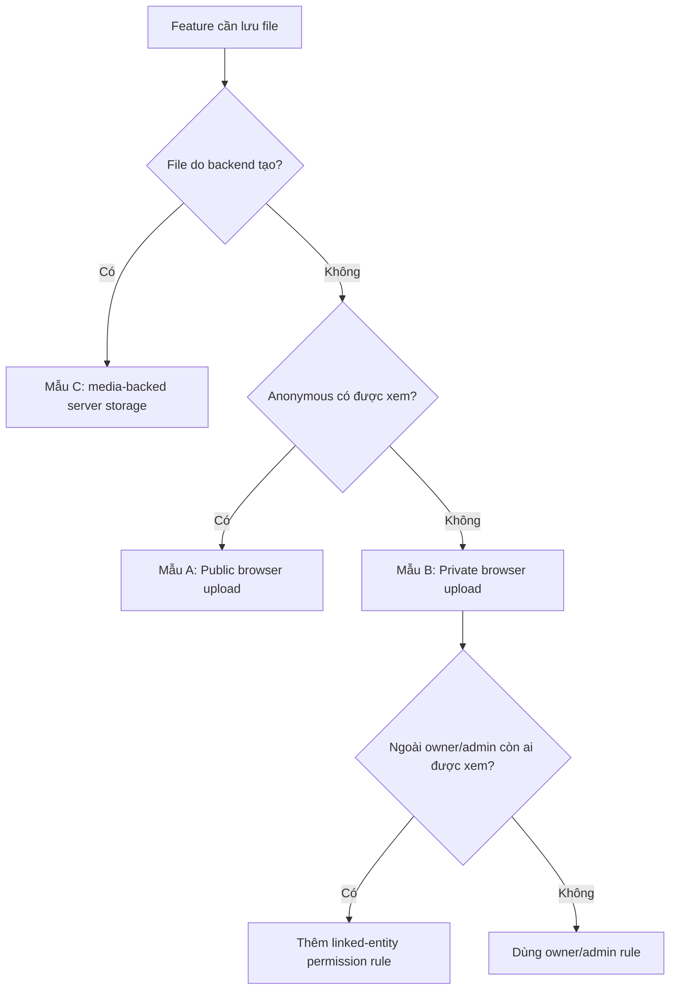

# AWS S3 New Feature Playbook

## 1. Mục tiêu

Tài liệu này là quy trình chuẩn để các tính năng phát triển sau này lưu file trên AWS S3 thông qua media subsystem của Smart Rental Platform.

Mục tiêu là để feature developer chỉ làm việc với `MediaAsset.Id` và business permission. Feature không tự quản lý bucket, object key, presigned URL hoặc AWS SDK.

Nguyên tắc bắt buộc:

1. S3 lưu binary; database lưu metadata, trạng thái và relationship.
2. Business entity tham chiếu `MediaAssetId`, không lưu S3 URL làm source of truth.
3. Browser upload qua media workflow dùng chung.
4. Backend-generated file đi qua media-backed storage adapter.
5. Private media phải kiểm tra quyền bằng linked business entity.
6. Replace/remove phải retire asset cũ.
7. Không gọi `AmazonS3Client` trực tiếp từ feature service.

Tài liệu kiến trúc và vận hành đầy đủ: [AWS S3 Media Implementation Guide](./AWS_S3_Media_Implementation_Guide.md).

## 2. Chọn mẫu triển khai

Trước khi code, chọn đúng một trong ba mẫu sau.

| Mẫu | Khi sử dụng | Ví dụ |
|---|---|---|
| A - Public browser upload | File được mọi người xem và do người dùng tải lên | Ảnh khu trọ, ảnh phòng, avatar, luật khu trọ |
| B - Private browser upload | File do người dùng tải lên nhưng chỉ các actor có quan hệ nghiệp vụ được xem | KYC, giấy tờ pháp lý, chat attachment, ảnh chốt điện nước |
| C - Server-generated media | Binary do backend tạo hoặc nhận từ provider | Contract PDF, appendix PDF, signed document, evidence file |

Decision tree:



Không chọn visibility theo việc màn hình upload thuộc landlord hay tenant. Visibility phụ thuộc người được phép đọc file sau khi đã link.

## 3. Thiết kế trước khi code

Feature owner và developer cần chốt các câu hỏi sau:

- File là image, PDF hay loại khác?
- Dung lượng tối đa của một file là bao nhiêu?
- Một entity có tối đa bao nhiêu file?
- Visibility là `Public` hay `Private`?
- Ai được upload và ai là `OwnerUserId`?
- Ai được view, download, replace và remove?
- Asset có được dùng lại cho nhiều entity không?
- Khi entity bị xóa, file được retire hay vẫn cần giữ theo retention policy?
- Upload từ browser, backend hay external provider?
- Có cần moderation, virus scan hoặc approval trước khi link không?

Kết quả thiết kế nên được ghi thành bảng:

| Thuộc tính | Giá trị mẫu |
|---|---|
| Feature | Maintenance evidence |
| Scope | `MaintenanceEvidence` |
| Visibility | Private |
| Types | JPG, PNG, PDF |
| Max size | 20 MB |
| Max count | 5 |
| Owner | User gửi yêu cầu |
| Readers | Requester, assigned landlord, admin |
| Linked entity | `MaintenanceRequest` |
| Replace policy | Retire asset cũ |
| Delete policy | Soft delete; physical cleanup theo worker |

## 4. Thay đổi server dùng chung

Chỉ thêm scope mới khi mục đích, validation hoặc permission khác scope hiện có. Không tái sử dụng scope chỉ vì cùng là ảnh.

### 4.1 Thêm scope

Thêm enum vào `MediaScope` với giá trị mới ổn định:

```csharp
public enum MediaScope
{
    // Existing values must not be renumbered.
    MaintenanceEvidence = 11
}
```

Không đổi số của scope cũ vì client và dữ liệu database phụ thuộc numeric value.

### 4.2 Thêm object-key folder

Thêm mapping trong `MediaObjectKeyFactory`:

```csharp
[MediaScope.MaintenanceEvidence] = "maintenance-evidence"
```

Object key sẽ được sinh theo convention:

```text
private/maintenance-evidence/{yyyy}/{MM}/{dd}/{random-guid}.{ext}
```

Feature không tự ghép key và không dùng original file name làm key.

### 4.3 Thêm validation policy

Thêm rule trong `MediaFileValidationPolicy`:

```csharp
MediaScope.MaintenanceEvidence => new MediaScopeRules(
    MaintenanceExtensions,
    MaintenanceContentTypes,
    20 * 1024 * 1024)
```

Validation phải thống nhất giữa extension, declared MIME, request body và metadata thực tế trên S3. Nếu cho phép loại file mới, cập nhật cả extension và MIME allow-list.

### 4.4 Thêm client scope map

Với browser upload, thêm scope vào `MediaWorkflowScope` và hai map trong `client/src/shared/api/media.ts`:

```ts
export type MediaWorkflowScope =
  | ExistingScope
  | 'MaintenanceEvidence';

const MEDIA_SCOPE_BY_UPLOAD_SCOPE = {
  MaintenanceEvidence: 11,
};

const MEDIA_VISIBILITY_BY_UPLOAD_SCOPE = {
  MaintenanceEvidence: 2,
};
```

`1` là Public, `2` là Private. Client mapping phải khớp enum server, nhưng server vẫn là nơi enforce policy cuối cùng.

## 5. Thay đổi business entity

### 5.1 Database reference

Entity lưu nullable FK/reference tới media:

```csharp
public Guid? EvidenceMediaAssetId { get; set; }
public MediaAsset? EvidenceMediaAsset { get; set; }
```

Với nhiều file, tạo entity liên kết riêng thay vì lưu danh sách ID hoặc URL trong JSON:

```csharp
public sealed class MaintenanceRequestMedia
{
    public Guid Id { get; set; }
    public Guid MaintenanceRequestId { get; set; }
    public Guid MediaAssetId { get; set; }
    public int DisplayOrder { get; set; }
}
```

EF configuration cần index/FK phù hợp. Migration chỉ tạo schema/reference; không seed URL giả vào cột media ID.

### 5.2 Request contract

Request nhận ID sau finalize:

```csharp
public sealed class UpdateMaintenanceEvidenceRequest
{
    public Guid? EvidenceMediaAssetId { get; set; }
    public bool ClearEvidence { get; set; }
}
```

Nếu update cần phân biệt “không gửi field” với “xóa reference”, dùng presence semantics rõ ràng như `ClearEvidence`. Không mặc định coi `null` là clear nếu `null` cũng có nghĩa field bị omitted.

Không thêm các field làm source of truth như:

```csharp
public string? EvidenceUrl { get; set; }
public string? S3ObjectKey { get; set; }
```

### 5.3 Response contract

Public response có thể trả media ID và URL API ổn định:

```json
{
  "evidenceMediaAssetId": "guid",
  "evidenceUrl": "/api/media/public/guid"
}
```

Private response ưu tiên trả media ID:

```json
{
  "evidenceMediaAssetId": "guid"
}
```

Không trả presigned URL trong read model dài hạn. Client chỉ yêu cầu URL tạm khi download.

## 6. Mẫu A - Public browser upload

Luồng chuẩn:

1. Client gọi `uploadFileViaMediaWorkflow(file, scope)`.
2. Media API tạo `PendingUpload` và presigned PUT.
3. Client PUT binary lên S3; nếu CORS/network lỗi thì retry qua backend proxy.
4. Client gọi finalize; server HEAD object và chuyển sang `Uploaded`.
5. Client submit business form với `mediaAssetId`.
6. Feature service validate và chuyển asset sang `Linked`.
7. UI render `/api/media/public/{mediaAssetId}`.

Client example:

```tsx
const uploaded = await uploadFileViaMediaWorkflow(file, 'RoomingHouse');

await roomingHouseApi.update(roomingHouseId, {
  imageMediaAssetId: uploaded.mediaAssetId,
});
```

Render:

```tsx

```

Public ở application level không có nghĩa bucket/object dùng public-read ACL. Bucket tiếp tục Block Public Access; API stream object sau khi kiểm tra media status và visibility.

## 7. Mẫu B - Private browser upload

Upload và finalize giống mẫu A, nhưng asset có `Visibility.Private`.

Private media không được render bằng public route hoặc URL S3 persist trong database.

Inline image:

```tsx
<PrivateMediaImage
  mediaAssetId={item.evidenceMediaAssetId}
  alt="Bằng chứng bảo trì"
/>
```

Component fetch blob qua authenticated API, tạo object URL và revoke khi unmount.

Download:

```ts
const result = await getPrivateMediaDownloadUrl(mediaAssetId);
window.open(result.url, '_blank', 'noopener,noreferrer');
```

Download URL có TTL ngắn và không được lưu lại trong state lâu dài, database, notification payload hoặc log.

### 7.1 Linked-entity permission

Nếu người đọc không phải owner/admin, thêm rule trong `DefaultMediaPermissionService` dựa trên `LinkedEntityType` và `LinkedEntityId`.

Ví dụ policy cho maintenance evidence:

- Requester tạo yêu cầu được đọc.
- Landlord sở hữu khu trọ liên quan được đọc.
- Assigned staff được đọc trong thời gian được phân công.
- User khác và anonymous bị từ chối.
- Admin được đọc và hành động phải được audit.

Không cấp quyền chỉ vì client biết `mediaAssetId`. GUID không phải access control.

## 8. Mẫu C - Server-generated media

File do backend tạo không cần browser upload session. Feature dùng `IFileStorageService` implementation `MediaBackedFileStorageService` hoặc media workflow server-side tương ứng.

Luồng:

1. Backend tạo binary trong memory/stream.
2. Adapter map `FileUploadScope` sang `MediaScope` và visibility.
3. Adapter sinh object key và upload qua `IMediaStorageService`.
4. Tạo `MediaAsset` với metadata thực tế.
5. Link media ID vào contract/signing/business entity.
6. Read/download vẫn đi qua media permission path.

Feature service không inject `IAmazonS3` và không tự gọi `PutObjectAsync`.

Khi thêm loại server-generated file mới:

- Thêm `FileUploadScope` nếu cần.
- Thêm mapping trong `MediaBackedFileStorageService`.
- Chọn đúng `MediaScope` và visibility.
- Gắn `LinkedEntityType/Id` để permission service kiểm tra được.
- Thêm permission và regression tests trước khi expose download.

## 9. Link, replace và remove an toàn về logic

### 9.1 Link asset

Feature service phải kiểm tra tối thiểu:

- Asset tồn tại.
- `OwnerUserId` đúng actor hoặc workflow server được phép.
- Scope đúng feature.
- Visibility đúng policy.
- Status là `Uploaded`.
- Asset chưa link entity khác.
- Asset không bị deleted.

Sau đó cập nhật reference và asset trong cùng transaction/`SaveChanges`:

```csharp
entity.EvidenceMediaAssetId = asset.Id;
asset.Status = MediaStatus.Linked;
asset.LinkedEntityType = nameof(MaintenanceRequest);
asset.LinkedEntityId = entity.Id;
asset.UpdatedAt = now;
```

### 9.2 Replace asset

Thứ tự chuẩn:

1. Validate asset mới hoàn toàn trước.
2. Ghi reference mới.
3. Link asset mới.
4. Chuyển asset cũ sang `Deleted`, set `DeletedAt`, clear linked reference.
5. Save tất cả trong một transaction.

Không retire asset cũ trước khi asset mới được validate vì request lỗi có thể làm mất reference đang hoạt động.

### 9.3 Remove asset

Clear request phải:

1. Kiểm tra actor có quyền sửa entity.
2. Set FK/reference trên entity thành null.
3. Retire asset cũ trong cùng transaction.
4. Read response và UI không tiếp tục fallback sang legacy URL.

Hiện retire là soft delete database. Physical object cleanup trên S3 cần worker/outbox riêng; không hứa với người dùng rằng object đã bị xóa vật lý ngay lập tức.

## 10. Atomicity và lỗi giữa S3/database

S3 và PostgreSQL không có distributed transaction. Thiết kế phải chấp nhận các tình huống:

- PUT thành công nhưng finalize không được gọi: có orphan object/`PendingUpload`.
- Finalize thành công nhưng business submit bị hủy: có unlinked `Uploaded` asset.
- DB retire thành công nhưng S3 delete thất bại: object còn tồn tại nhưng API đã chặn.

Quy tắc xử lý:

- Không rollback DB bằng cách đoán trạng thái S3.
- Cleanup vật lý dùng background worker/outbox có retry.
- Worker phải idempotent.
- Pending/uploaded orphan cần TTL và grace period.
- Ghi audit/metric cho lỗi upload, finalize, denied access và cleanup.

## 11. Testing bắt buộc

### 11.1 Server regression tests

Mỗi feature media mới cần cover:

- Happy path: đúng owner/scope/visibility/status link thành công.
- Asset không tồn tại.
- Wrong owner.
- Wrong scope.
- Wrong visibility.
- `PendingUpload` chưa finalize.
- Asset đã link entity khác.
- Replace retire asset cũ và link asset mới.
- Clear bỏ reference và retire asset cũ.
- Transaction lỗi không để entity trỏ tới asset invalid.
- Public asset đọc anonymous được.
- Private owner/actor hợp lệ đọc được.
- Private actor không hợp lệ nhận 403.
- Deleted asset không đọc/download được.
- File extension, MIME hoặc size không hợp lệ bị chặn.

### 11.2 Client tests với Vitest

Cover tối thiểu:

- Gửi đúng numeric scope và visibility.
- Signed PUT thành công thì finalize đúng media ID.
- S3 CORS/network failure fallback sang backend upload route.
- PUT thất bại cả hai đường thì không gọi finalize/business submit.
- Form submit dùng media ID, không dùng returned URL.
- Public component build đúng public media route.
- Private component fetch authenticated blob và revoke object URL.
- Replace/remove cập nhật UI đúng sau reload.

### 11.3 Manual browser test

Checklist ngắn:

1. Upload đúng loại file và submit feature.
2. Reload trang; file vẫn render/download được.
3. Mở public media ở tab incognito nếu feature public.
4. Mở private media khi logout hoặc user khác; phải bị chặn.
5. Replace file, reload và kiểm tra chỉ file mới còn được tham chiếu.
6. Remove file, reload và kiểm tra UI không fallback URL cũ.
7. Thử wrong extension, MIME và oversize.
8. Kiểm tra Network: business request gửi media ID.
9. Kiểm tra S3 CORS fallback nếu môi trường cho phép mô phỏng.
10. Kiểm tra audit log cho private view/download/denied.

## 12. Anti-patterns bị cấm

Không triển khai các cách sau:

- Lưu `image_url`, `file_url` hoặc presigned URL làm dữ liệu gốc.
- Lưu AWS bucket/object key trong feature DTO cho client.
- Feature service gọi AWS SDK trực tiếp.
- Public S3 bucket hoặc public-read ACL để bỏ qua media API.
- Dùng một scope chung cho mọi loại ảnh dù permission khác nhau.
- Tin extension/MIME/size do browser khai báo mà không finalize HEAD metadata.
- Render private route bằng `` khi bearer token không được gửi.
- Cho phép link asset chỉ vì GUID tồn tại.
- Replace reference nhưng không retire asset cũ.
- Clear reference ở UI nhưng backend không có presence semantics.
- Persist signed download URL vào database/cache dài hạn.
- Log access key, secret key hoặc full presigned URL.

## 13. Definition of Done

Một feature sử dụng AWS S3 chỉ được xem là hoàn thành khi:

- [ ] Scope và visibility được chốt theo business permission.
- [ ] Object-key mapping và validation policy đã có.
- [ ] Entity lưu media ID, không lưu S3 URL làm source of truth.
- [ ] Request/response contract có semantics replace/remove rõ ràng.
- [ ] Browser hoặc server-generated upload dùng abstraction hiện có.
- [ ] Feature service validate owner/scope/visibility/status/reuse.
- [ ] Asset và entity được link atomically.
- [ ] Replace/remove retire asset cũ.
- [ ] Public read dùng public media API route.
- [ ] Private read/download đi qua authenticated permission path.
- [ ] Linked-entity permission cover mọi actor hợp lệ.
- [ ] Regression tests, Vitest và manual reload test đạt.
- [ ] Không có credential, object key hoặc presigned URL thật trong source/log/docs.
- [ ] Cleanup/retention limitation được ghi nhận nếu physical deletion chưa triển khai.

## 14. File cần tham chiếu khi triển khai

- `server/src/SmartRentalPlatform.Domain/Enums/Media/MediaScope.cs`
- `server/src/SmartRentalPlatform.Domain/Entities/Media/MediaAsset.cs`
- `server/src/SmartRentalPlatform.Infrastructure/Storage/MediaObjectKeyFactory.cs`
- `server/src/SmartRentalPlatform.Infrastructure/Storage/MediaBackedFileStorageService.cs`
- `server/src/SmartRentalPlatform.Infrastructure/Media/MediaWorkflowService.cs`
- `server/src/SmartRentalPlatform.Infrastructure/Media/MediaFileValidationPolicy.cs`
- `server/src/SmartRentalPlatform.Infrastructure/Media/DefaultMediaPermissionService.cs`
- `server/src/SmartRentalPlatform.Api/Controllers/Media/MediaController.cs`
- `client/src/shared/api/media.ts`
- `client/src/shared/components/media/PrivateMediaImage.tsx`
- `docs/AWS_S3_Media_Implementation_Guide.md`
- `docs/Media_Manual_Test_Checklist.md`
